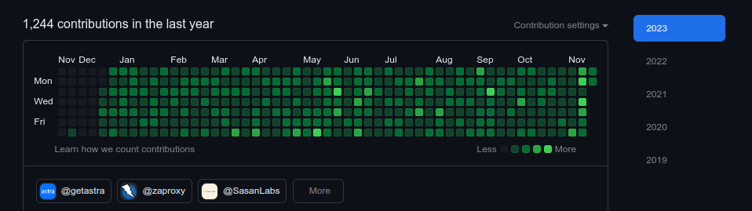

# github-flex


## Overview
GitHub Flex is a script designed to help you flex on your fellow programmers by giving your GitHub commit history a vibrant shade of green. With GitHub Flex, you can showcase a commit history that not only reflects your coding prowess but also catches the eye with its aesthetic appeal.

### For Gen Z:
Low-key transforms your GitHub commits, giving your contribution graph a bussin' glow that slaps. It gives off major coding vibes and has your commit game on point! 💻💚 

## How to Use

1. **Fork the Repository:**
   - Click the "Fork" button at the top right of this repository page to create your own copy.

2. **Clone the Repository:**
   - Open your terminal and run the following command to clone the forked repository to your local machine:

     ```bash
     git clone https://github.com/karthikuj/github-flex.git
     ```

3. **Navigate to the Project Directory:**
   - Change into the project directory using the following command:

     ```bash
     cd github-flex
     ```

4. **Run the GitHub Flex Script:**
   - Execute the `github-flex.py` script to start customizing your commit history:

     ```bash
     python3 github-flex.py
     ```


## Before


## After
